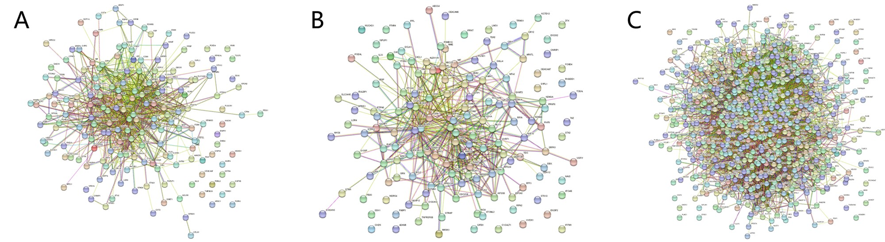
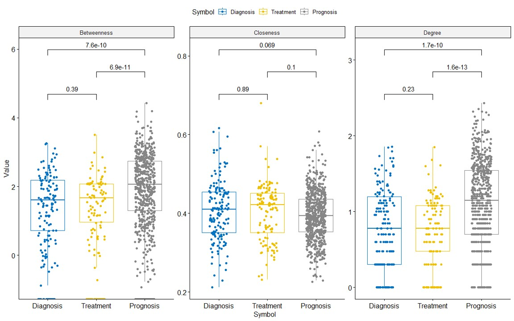
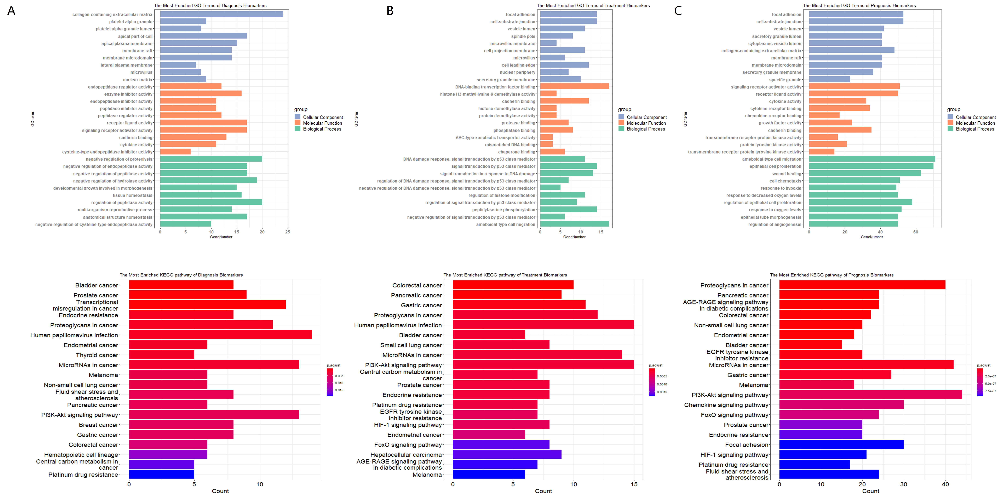

# <i class="fa-solid fa-microscope"></i> Data Analysis

---

## Integrated Network Analysis of Biomarkers in CBD2

To showcase the clinical relevance of the identified CRC biomarkers for diagnosis, treatment, and prognosis, we presented a case study that demonstrates the utility of CBD2 for analyzing biomarkers in a practical setting.

We constructed the BBI networks for the existing diagnostic, therapeutic, and prognostic protein biomarkers in CBD2 and calculated network parameters in the **"Explore"** page, followed by **GO functional enrichment analysis** and **KEGG pathway enrichment analysis**.

The networks of related three types of biomarkers were shown in Figure 14. We found that the number of biomarkers used for the prognosis of CRC is significantly higher than those used for diagnosis and treatment, which is consistent with medical practice:

1. Various factors, such as tumor size, location, degree of differentiation, metastasis, and treatment options, could impact the survival period and quality of life of cancer patients after treatment. Therefore, multiple biomarkers were needed to comprehensively assess the prognosis;
2. Specific and precise biomarkers were needed to guide the determination of cancer type and stage and the selection of appropriate treatment methods. Therefore, diagnosis and treatment may required only a few biomarkers. What’s more, early diagnosis and effective treatment of cancer remained significant challenges, which was also a crucial factor contributing to the relatively small number of biomarkers available for these purposes.

Box plots of topological parameters were shown in Figure 15. We noticed that the Closeness parameter had no obvious inter-group difference, while for Betweenness and Degree, the difference mainly appears in the Prognosis group and the other two marker groups.

Degree in PPI networks referred to the number of connections that a given protein has with other proteins, indicating its level of connectivity. Betweenness was a measure of the number of shortest paths that pass through a given protein, indicating its importance as a mediator of information flow within the network. Closeness measured the average shortest path between a protein and all other proteins in the network. It reflected how easily information can be transmitted from one protein to another in the network.

It's noteworthy that the scale of the network might influence these metrics, especially Degree. Larger networks might have a higher average degree, but this also depends on the sparsity or density of the network. For Betweenness, more “bridging” nodes might exist in larger networks, but this is not always the case since it depends on the specific structure of the network.

Considering the above situation, Following conclusions were indicated:

1. The lack of inter-group difference in the Closeness parameter suggested that the nodes in the different marker groups were similarly connected and can transmit information efficiently in the network. This may indicated that the selected biomarkers for CRC diagnosis, treatment, and prognosis were all functionally related and contributed to the overall network connectivity;
2. The differences in the Betweenness and Degree parameters between the prognosis group and the other two marker groups indicated that the nodes in the prognosis group have a greater influence on the network structure than the nodes in the diagnosis and treatment groups. This may implyed that the selected biomarkers for CRC prognosis are more important for the overall network structure and function.

We performed an enrichment analysis of the resulting proteins. (Figure 16) 

The obvious difference between the cellular components enriched for biomarkers for the diagnosis, treatment, and prognosis of CRC was that they reflect different aspects of the disease. The cellular components enriched for biomarkers for the diagnosis of CRC, such as the collagen-containing extracellular matrix and platelet alpha granule, were primarily involved in the regulation of cell proliferation, migration, and invasion, which are important processes in cancer development and progression. The cellular components enriched for biomarkers for treatment of CRC, such as focal adhesion and cell-substrate junction, were involved in the regulation of cell adhesion, migration, and signaling, which were important processes in drug response and resistance. The cellular components enriched for biomarkers for CRC prognosis, such as secretory granule lumen and collagen-containing extracellular matrix, were involved in the regulation of cell survival, proliferation, and metastasis, which were important processes in cancer recurrence and survival.

Analogously, comparable outcomes could be inferred regarding the molecular functions and biological processes of these biomarkers. However, we placed greater emphasis on the pathway enrichment of these biomarkers rather than on functional enrichment data.

From the perspective of their respective enriched pathways, we found that there were highly overlapping co-enriched pathways among biomarkers of different aspects of CRC. For example, **"Proteoglycans in cancer"** pathway was enriched in biomarkers for the diagnosis, treatment, and prognosis of CRC, suggesting that this pathway may play a key role in all stages of CRC. Likewise, the **"PI3K-Akt signaling pathway"** was enriched in biomarkers for the diagnosis and prognosis of CRC, while the pathway **"EGFR tyrosine kinase inhibitor resistance"** was enriched in biomarkers for the treatment and prognosis of CRC. These overlaps in enriched pathways suggested that some pathways may had multifaceted roles in CRC, and targeting them may had broader implications for the diagnosis, treatment, and prognosis of CRC. The network construction and analysis results of the above three types of biomarkers could be obtained with one click on our **"Explore"** Page.

## ncRNA-gene Interaction Network

374 ncRNA biomarkers have been collected in CBD2, of which 210 belong to miRNA. We finally parsed 251 standard miRNA Identifiers from them. By constraining the Organism parameter to “H. sapiens (human)” and refining the Tissue parameter to “Intestine”, these miRNAs, in conjunction with 796 protein biomarkers from CBD2, were input into miRNet15 with the aim of constructing a network elucidating the interactions between ncRNA and genes.

The ncRNA-gene interaction network was presented in Figure 17. We found that hsa-mir-92a-3p, hsa-mir-103a-3p, hsa-mir-21-5p, hsa-mir-7-5p, hsa-mir-34a-5p, hsa-mir-30a-5p, hsa-mir-26a-5p, hsa-mir-186-5p and hsa-mir-362-3p were the hubs in the network, 7 of them are included in CBD2. We additionally conducted enrichment analysis utilizing both KEGG and DisGeNET on the delineated network, the results of which exhibited a pronounced correlation with colorectal cancer, underscoring the potential significance of the identified ncRNA-gene interactions in the context of this malignancy.

