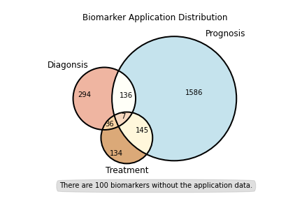

# <i class="fa-solid fa-chart-simple"></i> Data Collection and Statistics

---

In earlier versions of CBD, all of the biomarkers and their information are collected from PubMed database with the key words: 

```
(((((biomarker [Title/Abstract]) OR marker [Title/Abstract]) OR indicator [Title/Abstract]) OR predictor [Title/Abstract])) AND ((((((colorectal cancer [Title/Abstract]) OR rectal cancer [Title/Abstract]) OR bowel cancer [Title/Abstract])))).
```

Now we have made a comprehensive update in terms of content and visual in CBD2. As shown in Figure 3, our sorting of the articles has gone through the following steps: 

1. Remove nonexperimental articles such as interview, editorial, erratum and not in English paper;
2. Manually read the titles and abstracts of the articles to exclude results that did not fit our theme, were incomplete, and had results that were not statistically significant.


Finally, 690 original articles were included in this update through manual full-text reading and group discussion, and the total number of biomarkers has reached to 2439. CBD2 expands the biological categories of biomarkers to DNA, RNA, protein, metabolite, microbiome, image, and others, and expands the clinical categories to prediction, diagnosis, treatment, and prognosis. CBD2 also includes the reported objects that can not be biomarkers for CRC, which were defined as non-biomarkers in the database. The distribution of biomarker categories in CBD2 is shown in Figure 4.

<iframe scrolling="no" style="border:none;" seamless="seamless" src="../images/frame-img/overview.html" height="620" width="100%"></iframe>

<center>
<div class="img-caption">Figure 4. Biomarker Category Distribution</div>
</center>


Currently 857,840 samples are included in CBD2,  339,537 males and  278,798 females, with no gender information provided for the remaining samples. (Figure 5)

<iframe scrolling="no" style="border:none;" seamless="seamless" src="../images/frame-img/gender.html" height="400" width="100"></iframe>

<center>
<div class="img-caption">Figure 5. Gender Distribution</div>
</center>


For region distribution, CBD continues CRC biomarker researches from 6 Continents: Africa, Asia, Europe, North America, Oceania, South America. Figure 6 shows the distribution of researches according to continents and countries. Most of the researches concluded in our CBD were from Asia and Europe.

<iframe scrolling="no" style="border:none;" seamless="seamless" src="../images/frame-img/continents.html" height="1000" width="100%"></iframe>

<center>
<div class="img-caption">Figure 6. Biomarkers in Different Continents</div>
</center>


In addition, we divided the samples within the CBD into Asians and non-Asian races to study the differences and similarities among different races. The statistical results are shown in Figure 7. We found that the number of studies on Asians and non-Asians It's almost equivalent.

<iframe scrolling="no" style="border:none;" seamless="seamless" src="../images/frame-img/Asian.html" height="400" width="100%"></iframe>

<center>
<div class="img-caption">Figure 7. Race Summary for Research Number</div>
</center>

Figure 8 shows a comparison of the number of the most studied biomarkers common to Asians and non-Asian races. For example, among Asians and non-Asians, Carcinoembryonic antigen (CEA) has been the most studied. Among them, 12 studies included samples of Asians and 25 studies included samples of non-Asians.


<iframe scrolling="no" style="border:none;" seamless="seamless" src="../images/frame-img/race_compare.html" height="400" width="100%"></iframe>

<center>
<div class="img-caption">Figure 8. Comparison of the number of the most studied biomarkers common to Asians and Non-Asian Races</div>
</center>


Meanwhile we calculated the cancer location of each concluded research, and the number of colon, rectum cancer are showed in Figure 9, from which we can see that most of research (1809) studied both colon and rectum, and few research is rarely studied colon or rectum.


<!--<center>-->
<!--<div class="img-caption">Figure 9. Cancer Location of Each Concluded Research</div>-->
<!--</center>-->

The source where the biomarkers come from were also counted and showed in Figure 10, from which we can see that most of the biomarkers are from Tissue, Blood and Cell line. 

<iframe scrolling="no" style="border:none;" seamless="seamless" src="../images/frame-img/source.html" height="620" width="100%"></iframe>

<center>
<div class="img-caption">Figure 10. Summary of Biomarker Source</div>
</center>


As shown in Figure 11 & 12, for the function of biomarkers in our database, we also made professional statistic by summarizing them into three types: Diagnostic biomarker, therapeutic biomarker, and prognostic biomarker.

<iframe scrolling="no" style="border:none;" seamless="seamless" src="../images/frame-img/application.html" height="620" width="100%"></iframe>

<center>
<div class="img-caption">Figure 11. Biomarker Application Distribution, shown in histogram and pie chart</div>
</center>




<!--<center>-->
<!--<div class="img-caption">Figure 12. Biomarker Application Distribution, shown in a Venn diagram</div>-->
<!--</center>-->

As we all know, experiment method is very important to a research, we also summarized the experiment used by each research. Figure 13 showed the experiment methods of all the studies. We hope it will provide a reference for researchers who conduct related research

<iframe scrolling="no" style="border:none;" seamless="seamless" src="../images/frame-img/experiment.html" height="620" width="100%"></iframe>

<center>
<div class="img-caption">Figure 13. Experiment Method Used in Researchs</div>
</center>


To sum up, CBD is an all-encompassing database whose data comes from all continents of the world, from different races, and from various tissues of the body. We do hope that our database will help researchers and contribute to cancer research.